# Lorem ipsum

**Lorem ipsum** dolor sit amet, consectetur adipiscing elit. Nunc luctus
bibendum felis dictum sodales.

``` code
print("hello")
```

## Pyout

``` code
from IPython.display import HTML
HTML("""
<script>
console.log("hello");
</script>
<b>HTML</b>
""")
```

## Image


This image 
<div> </div> 

 will be included as a cell attachment.